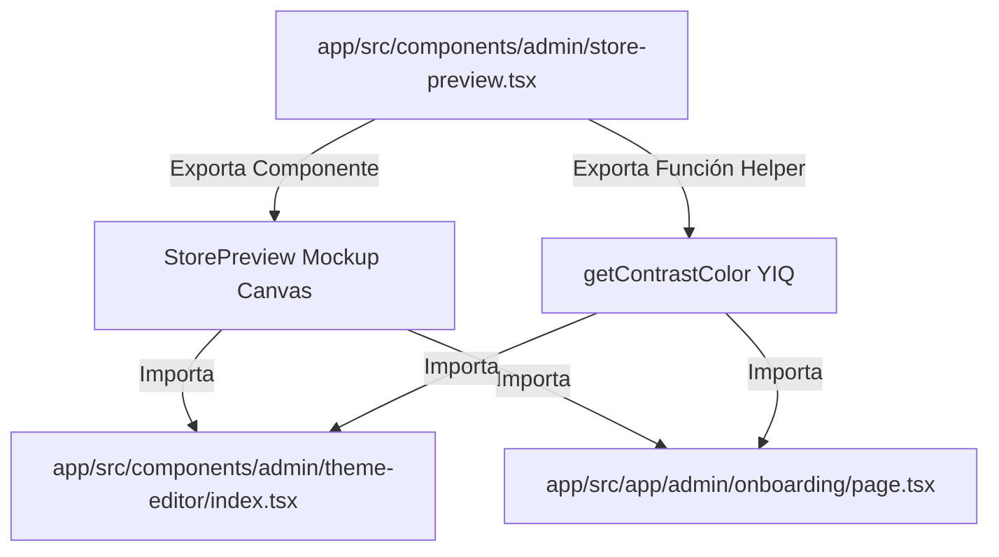

# Design Document: Experiencia de Marca Premium

**ID:** `app-premium-brand-experience`

---

## 🏗️ Arquitectura de Componentes

Diseñamos una arquitectura modular y desacoplada para evitar duplicaciones y asegurar la consistencia del catálogo simulado en todo el frontend.



---

## 🛠️ Detalles de la Implementación Técnica

### 1. Componente Compartido: `<StorePreview />`
*   **Path**: `app/src/components/admin/store-preview.tsx`
*   **Props**:
    ```typescript
    interface StorePreviewProps {
      primaryColor: string;
      accentColor: string;
      backgroundColor: string;
      storeName?: string;
    }
    ```
*   **Estado Interno**:
    *   `view`: `'catalog' | 'product'` (Controlado mediante pestañas interactivas de alta fidelidad).
*   **Estructura del Mockup**:
    *   **Catálogo**: Cabecera (Color Primario), Categorías (Color Primario / Texto adaptativo), Lista de Productos en Grid, Botón Flotante del Carrito (Color Secundario / Texto adaptativo).
    *   **Detalle**: Cajón deslizante tipo Drawer simulando la ficha del producto, nombre, precio, descripción, y un botón destacado "Agregar al Carrito" (Color Secundario).

### 2. Algoritmo de Luminancia de Contraste (YIQ)
Para asegurar que el texto superpuesto sobre colores dinámicos sea legible, implementamos un helper basado en la fórmula estándar YIQ:
```typescript
export function getContrastColor(hexColor: string): string {
  // Limpiar el prefijo #
  const hex = hexColor.replace("#", "");
  
  // Parsear a RGB
  const r = parseInt(hex.substring(0, 2), 16);
  const g = parseInt(hex.substring(2, 4), 16);
  const b = parseInt(hex.substring(4, 6), 16);
  
  // Calcular luminancia YIQ
  const yiq = (r * 299 + g * 587 + b * 114) / 1000;
  
  // Retornar negro para colores claros, blanco para oscuros
  return yiq >= 128 ? "#000000" : "#FFFFFF";
}
```

### 3. Presets de Paletas Elegantes
Definimos 6 paletas precalculadas en una estructura constante para inyectar en los formularios de Onboarding y ThemeEditor:
```typescript
const CURATED_THEMES = [
  { name: "Obsidiana", primary: "#18181B", accent: "#E4E4E7", bg: "#FFFFFF" },
  { name: "Burdeos", primary: "#6B1D2F", accent: "#F87171", bg: "#FDFBF7" },
  { name: "Esmeralda", primary: "#1B4332", accent: "#34D399", bg: "#F2F5F1" },
  { name: "Terracota", primary: "#C05C3E", accent: "#FB923C", bg: "#FDFBF7" },
  { name: "Prusia", primary: "#0F3D59", accent: "#2DD4BF", bg: "#F8F9FA" },
  { name: "Cacao Artisan", primary: "#4A3728", accent: "#F59E0B", bg: "#FDFBF7" }
];
```

### 4. Responsividad Táctil en Tooltips
*   **Desktop (`>= 768px`)**: Muestra un tooltip flotante usando `absolute bottom-full left-1/2 -translate-x-1/2 mb-2 hidden group-hover:block` animado con clases de Tailwind v4 (`animate-in fade-in duration-200`).
*   **Mobile (`< 768px`)**: El wrapper de tooltip se oculta con `hidden md:inline-flex`.
    *   En el Dashboard, se añaden etiquetas de párrafo inline debajo de cada input (`p className="md:hidden text-xs text-muted-foreground/80 pt-1"`).
    *   En Onboarding, se inserta un bloque de ayuda consolidado arriba del selector (`div className="md:hidden p-3 rounded-xl bg-accent/30"`).
