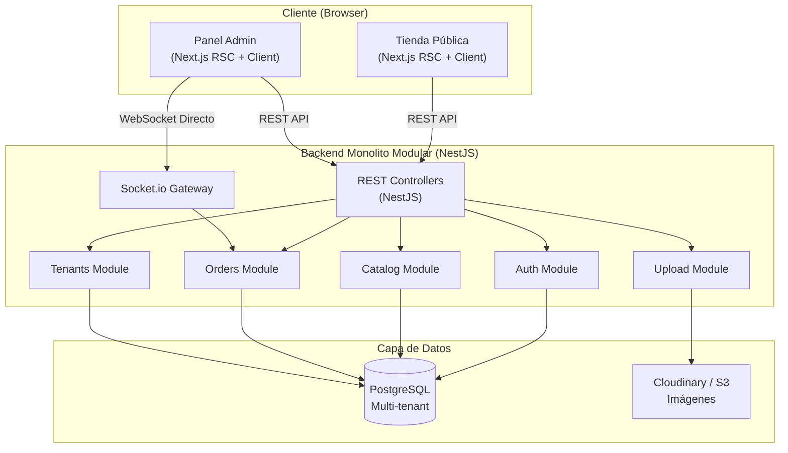

# Arquitectura del Sistema - PickyApp

## 1. Visión General

PickyApp adopta una arquitectura **Monolito Modular** diseñada para ser escalable, mantenible y robusta. Esta decisión arquitectónica permite desarrollo rápido del MVP manteniendo la posibilidad de evolucionar a microservicios en el futuro.

- **Frontend**: Next.js 15.x (App Router, TypeScript)
- **Backend**: NestJS 10+ (TypeScript, Modular)
- **Base de Datos**: PostgreSQL 16 con TypeORM
- **Comunicación**: REST API + WebSocket Directo (Socket.io-client)
- **Patrón Multi-tenant**: Row-Level Security (RLS) simulado con aislamiento estricto por `tenant_id`

### Diagrama de Alto Nivel



## 2. Backend (NestJS)

### 2.1 Capas de la Aplicación

La aplicación sigue una arquitectura en capas con separación clara de responsabilidades:

#### 1. Capa de Presentación (Controllers/Gateways)
- **Responsabilidad**: Manejo de requests HTTP y conexiones WebSocket.
- **Componentes**: Controllers, DTOs, Guards, Interceptors.
- **Validación**: `class-validator` + `ValidationPipe` global en DTOs.
- **Autenticación**: Guards basados en la cookie HttpOnly generada en el login.
- **Ejemplo**: `CategoriesController`, `OrdersGateway`.

#### 2. Capa de Aplicación (Services)
- **Responsabilidad**: Orquestación de lógica de negocio y casos de uso.
- **Componentes**: Services, utilidades de negocio.
- **Transacciones**: Uso de QueryRunner de TypeORM para operaciones críticas complejas.
- **Ejemplo**: `CatalogService`, `OrdersService`.

#### 3. Capa de Dominio (Entities/Models)
- **Responsabilidad**: Definición de las entidades de base de datos y reglas fundamentales.
- **Componentes**: TypeORM Entities con decorators.
- **Validación**: Constraints a nivel de BD (Primary Keys, Indexes, Foreign Keys).
- **Ejemplo**: `Product`, `Order`, `Category`.

#### 4. Capa de Infraestructura (Repositories/Adapters)
- **Responsabilidad**: Persistencia de datos e interacción con servicios externos (Cloudinary).
- **Componentes**: TypeORM Repositories heredados, Custom Adapters.
- **Ejemplo**: `InjectRepository(Product)`, `CloudinaryService`.

### 2.2 Módulos Principales

```
src/
├── modules/
│   ├── auth/                    # Autenticación (JWT, Cookie management)
│   │   ├── auth.module.ts
│   │   ├── auth.controller.ts
│   │   ├── auth.service.ts
│   │   ├── strategies/          # JWT strategy
│   │   └── dto/                 # Login, Register DTOs
│   │
│   ├── tenants/                 # Administración de comercios
│   │   ├── tenants.module.ts
│   │   ├── tenants.controller.ts
│   │   ├── tenants.service.ts
│   │   └── entities/            # Tenant, StoreSettings
│   │
│   ├── catalog/                 # Catálogo (Categorías + Productos)
│   │   ├── catalog.module.ts
│   │   ├── categories.controller.ts
│   │   ├── products.controller.ts
│   │   ├── catalog.service.ts
│   │   └── entities/            # Category, Product, OptionGroup
│   │
│   ├── orders/                  # Flujo de pedidos y WebSocket
│   │   ├── orders.module.ts
│   │   ├── orders.controller.ts
│   │   ├── orders.service.ts
│   │   ├── orders.gateway.ts    # Socket.io Gateway
│   │   └── entities/            # Order, OrderItem
│   │
│   └── upload/                  # Subida y firma para imágenes
│       ├── upload.module.ts
│       ├── upload.controller.ts
│       └── upload.service.ts
│
├── common/                      # Utilidades globales
│   ├── decorators/              # @CurrentUser, @TenantId
│   ├── guards/                  # JwtAuthGuard, RolesGuard
│   ├── interceptors/            # TenantInterceptor (Inyección de tenant_id)
│   ├── filters/                 # GlobalExceptionFilter
│   └── pipes/                   # Global ValidationPipe
│
└── config/                      # Esquemas de variables de entorno
    ├── database.config.ts
    ├── jwt.config.ts
    └── app.config.ts
```

### 2.3 Patrón Multi-Tenant (Tenant-Isolation)

**Estrategia**: Row-Level Isolation estricto con indexado compuesto `tenant_id`.

Cada entidad sensible al multi-tenant incluye la columna `tenant_id` con índice para garantizar eficiencia en las queries:

```typescript
@Entity('products')
export class Product {
  @PrimaryGeneratedColumn('uuid')
  id: string;

  @Column({ name: 'tenant_id', type: 'uuid' })
  @Index()
  tenantId: string;

  // ... atributos del producto
}
```

**Inyección Dinámica**: `TenantInterceptor` intercepta la llamada, extrae el context del request y asegura que todas las queries filtren u operen bajo el `tenant_id` correspondiente al JWT del usuario autenticado o al subdominio/tienda visitada.

---

## 3. Frontend (Next.js 15 App Router)

### 3.1 Estructura de Arquitectura

Se adopta una arquitectura **Feature-Sliced Design (FSD) adaptada a Next.js 15 App Router**, priorizando la separación por grupos de rutas y la diferenciación clara entre componentes de Servidor (RSC) y de Cliente (RCC):

```
src/
├── app/                             # File-system Router de Next.js 15
│   ├── layout.tsx                   # Root layout (HTML, body, fonts)
│   ├── globals.css                  # Configuración Tailwind CSS v4
│   ├── (store)/                     # Grupo de rutas: Tienda Pública
│   │   └── [slug]/
│   │       ├── layout.tsx           # SSR anti-FOUC y carga de tema dinámico
│   │       ├── page.tsx             # Home de la Tienda
│   │       ├── product/[id]/        # Ficha de producto
│   │       └── checkout/            # Proceso de compra
│   ├── (admin)/                     # Grupo de rutas: Panel Administrativo
│   │   └── admin/
│   │       ├── layout.tsx           # Layout del panel lateral (Desktop/Mobile)
│   │       ├── dashboard/           # Métricas del día
│   │       ├── catalog/             # Gestión de categorías y productos
│   │       └── orders/              # Tablero Kanban en tiempo real
│   └── auth/                        # Rutas de Login/Registro/Password Reset
│
├── components/                      # Capa de componentes visuales
│   ├── ui/                          # Componentes base de shadcn/ui (Radix)
│   ├── shared/                      # Custom components agnósticos (Buttons, Modals)
│   ├── store/                       # Componentes específicos del Storefront (Cart, Search)
│   └── admin/                       # Componentes del panel (MetricCards, KanbanColumn)
│
├── lib/                             # Capa lógica core
│   ├── api/                         # Cliente Axios e integración de endpoints
│   ├── hooks/                       # Custom hooks globales (useWindowSize, etc.)
│   ├── stores/                      # Estado global del cliente con Zustand
│   ├── utils/                       # Utilidades generales (cn, formatting)
│   └── providers/                   # Contexts: React Query Client, ThemeProvider
```

### 3.2 Gestión de Estado

Se utiliza una estrategia dual altamente desacoplada:

1. **Estado del Servidor (Server State)**: **TanStack Query (React Query v5)**.
   - Utilizado para todo lo que provenga de una petición HTTP (listado de productos, categorías, pedidos).
   - Maneja cacheo, revalidación automática ante eventos de WebSocket, optimistic updates e invalidación reactiva.

2. **Estado del Cliente (Client UI State)**: **Zustand v5**.
   - Se utiliza para estado 100% local que no requiere persistir en BD inmediatamente o que cruza pantallas (ej. el Carrito de compras del usuario, el Drawer colapsable de navegación).
   - Cuenta con middleware persistencia en LocalStorage para retener el carrito.

### 3.3 Paradigma de Componentes (RSC & RCC)

- **React Server Components (RSC) por defecto**: Todas las páginas y layouts cargan la data pesada (ej. metadatos del comercio para prevenir FOUC) directamente desde el servidor, mejorando SEO y TTI.
- **React Client Components (RCC) dinámicos**: Se marcan explícitamente con `"use client"` solo aquellos componentes que requieren hooks de React (`useState`, `useEffect`), APIs del browser, o librerías interactivas (Zustand, Vaul).

---

## 4. Patrones de Diseño Claves

### 4.1 Data Fetching y SSR Anti-FOUC (Frontend)
El tema dinámico (colores de marca) se resuelve en el `layout.tsx` del grupo `[slug]` en el servidor, inyectando variables CSS antes de enviar el HTML inicial al cliente para evitar parpadeos visuales:

```tsx
// app/(store)/[slug]/layout.tsx
export default async function StoreLayout({ params, children }: LayoutProps) {
  const tenantTheme = await getTenantTheme(params.slug); // Fetch directo de API/BD en Server Side
  
  return (
    <div style={{ '--color-primary': tenantTheme.primaryColor } as React.CSSProperties}>
      {children}
    </div>
  );
}
```

### 4.2 React Hook Form + Zod (Formularios)
Validación estructurada e inferencia de tipos para robustez en validaciones complejas (ej. creación de variantes de producto):

```tsx
const productSchema = z.object({
  name: z.string().min(3, "Mínimo 3 letras"),
  price: z.number().positive("Debe ser un precio real"),
});
// React Hook Form utiliza el resolver para tipar y validar automáticamente
```

### 4.3 Conexión WebSocket Directa
El frontend se conecta al WebSocket Gateway de NestJS directamente desde un Client Component (usando React Query para mutar el cache local cuando entra un pedido nuevo):

```tsx
// Un hook en lib/hooks/useOrdersWebSocket.ts escucha el evento
socket.on('order:new', (newOrder) => {
  queryClient.invalidateQueries({ queryKey: ['orders'] });
  playOrderSound();
});
```

---

## 5. Decisiones Arquitectónicas Consolidadas

### 5.1 Next.js 15 vs Next.js 14
**Decisión**: Next.js 15.
**Justificación**: Ofrece caching por defecto más intuitivo, compatibilidad nativa con las APIs estables de React 19, y soporte mejorado para bundlers modernos como Turbopack en desarrollo.

### 5.2 Tailwind CSS v4 vs SCSS
**Decisión**: Tailwind CSS v4.
**Justificación**: El nuevo motor "LightningCSS" provee compilación en tiempo real extremadamente veloz, variables CSS nativas más potentes y elimina por completo el boilerplate del diseño modular.

### 5.3 Zustand vs Redux/Context
**Decisión**: Zustand.
**Justificación**: Es sustancialmente más ligero, no requiere wrappers a nivel del App Router (previniendo renderizados de cliente innecesarios en RSC) y su sintaxis reduce el boilerplate drásticamente.

### 5.4 Vaul para Mobile-First
**Decisión**: Vaul Drawer.
**Justificación**: Garantiza una sensación nativa (físicas de drag y cierre al deslizar hacia abajo) en mobile, algo crítico para superar la UX de competidores heredados. En desktop, se adapta visualmente a Dialog clásico vía shadcn/ui.

