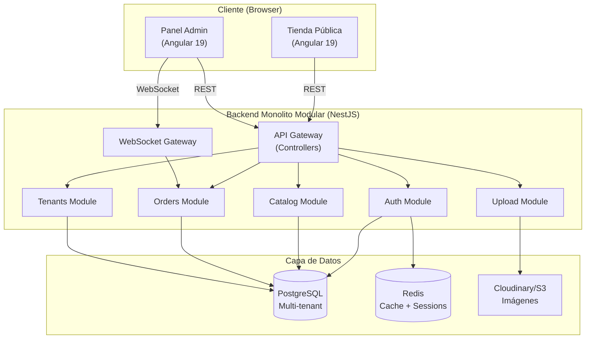

# Arquitectura del Sistema - PickyApp

## 1. Visión General

PickyApp adopta una arquitectura **Monolito Modular** diseñada para ser escalable, mantenible y robusta. Esta decisión arquitectónica permite desarrollo rápido del MVP manteniendo la posibilidad de evolucionar a microservicios en el futuro.

- **Frontend**: Angular 19 (Standalone Components, Signals)
- **Backend**: NestJS 10+ (TypeScript, Modular)
- **Base de Datos**: PostgreSQL 15+ con TypeORM
- **Comunicación**: REST API + WebSocket (Socket.io)
- **Patrón**: Multi-tenant con aislamiento por tenant_id

### Diagrama de Alto Nivel



## 2. Backend (NestJS)

### 2.1 Capas de la Aplicación

La aplicación sigue una arquitectura en capas con separación clara de responsabilidades:

#### 1. Capa de Presentación (Controllers/Gateways)
- **Responsabilidad**: Manejo de requests HTTP y WebSocket
- **Componentes**: Controllers, DTOs, Guards, Interceptors
- **Validación**: class-validator en DTOs
- **Autenticación**: JWT Guards
- **Ejemplo**: `CategoriesController`, `OrdersGateway`

#### 2. Capa de Aplicación (Services)
- **Responsabilidad**: Orquestación de lógica de negocio
- **Componentes**: Services, Use Cases
- **Transacciones**: Manejo de operaciones atómicas
- **Ejemplo**: `CatalogService`, `OrdersService`

#### 3. Capa de Dominio (Entities/Models)
- **Responsabilidad**: Reglas de negocio y modelos de datos
- **Componentes**: TypeORM Entities, Interfaces
- **Validación**: Constraints de base de datos
- **Ejemplo**: `Product`, `Order`, `Category`

#### 4. Capa de Infraestructura (Repositories/Adapters)
- **Responsabilidad**: Acceso a datos e integraciones externas
- **Componentes**: TypeORM Repositories, External APIs
- **Ejemplo**: `ProductRepository`, `CloudinaryAdapter`

### 2.2 Módulos Principales

```
src/
├── modules/
│   ├── auth/                    # Autenticación y autorización
│   │   ├── auth.module.ts
│   │   ├── auth.controller.ts
│   │   ├── auth.service.ts
│   │   ├── strategies/          # JWT, Local strategies
│   │   └── dto/                 # Login, Register DTOs
│   │
│   ├── tenants/                 # Gestión de comercios
│   │   ├── tenants.module.ts
│   │   ├── tenants.controller.ts
│   │   ├── tenants.service.ts
│   │   └── entities/            # Tenant, StoreSettings
│   │
│   ├── catalog/                 # Catálogo (categorías + productos)
│   │   ├── catalog.module.ts
│   │   ├── categories.controller.ts
│   │   ├── products.controller.ts
│   │   ├── catalog.service.ts
│   │   └── entities/            # Category, Product, OptionGroup
│   │
│   ├── orders/                  # Gestión de pedidos
│   │   ├── orders.module.ts
│   │   ├── orders.controller.ts
│   │   ├── orders.service.ts
│   │   ├── orders.gateway.ts    # WebSocket
│   │   └── entities/            # Order, OrderItem
│   │
│   └── upload/                  # Subida de imágenes
│       ├── upload.module.ts
│       ├── upload.controller.ts
│       └── upload.service.ts
│
├── common/                      # Código compartido
│   ├── decorators/              # @TenantId, @CurrentUser
│   ├── guards/                  # JwtAuthGuard, TenantGuard
│   ├── interceptors/            # TenantContextInterceptor
│   ├── filters/                 # HttpExceptionFilter
│   └── pipes/                   # ValidationPipe
│
└── config/                      # Configuración
    ├── database.config.ts
    ├── jwt.config.ts
    └── app.config.ts
```

### 2.3 Patrón Multi-Tenant

**Estrategia**: Row-Level Multi-tenancy con tenant_id

Cada entidad incluye la columna `tenant_id` que identifica al comercio propietario:

```typescript
@Entity('products')
export class Product {
  @PrimaryGeneratedColumn('uuid')
  id: string;

  @Column({ name: 'tenant_id' })
  @Index()
  tenantId: string;

  // ... otros campos
}
```

**Aislamiento automático** mediante `TenantContextInterceptor`:

```typescript
// El interceptor extrae tenantId del JWT y lo inyecta en el contexto
// Todos los repositorios filtran automáticamente por tenantId
const products = await this.productRepository.find({
  where: { tenantId: currentUser.tenantId }
});
```

## 3. Frontend (Angular 19)

### 3.1 Arquitectura

La estructura del proyecto se organiza por **Features** (Feature-Sliced Design adaptado):

```
src/app/
├── core/                        # Servicios singleton
│   ├── auth/                    # AuthService, Guards, Interceptors
│   ├── services/                # ApiService, StoreService, WebSocketService
│   └── models/                  # Interfaces TypeScript globales
│
├── shared/                      # Componentes reutilizables
│   ├── components/              # Button, Card, Modal, Toast, etc.
│   ├── pipes/                   # CurrencyFormat, TimeAgo
│   └── directives/              # LazyImage, Ripple
│
├── features/                    # Módulos de negocio
│   ├── store-front/             # Tienda pública
│   │   ├── pages/               # Home, Category, ProductDetail, Cart, Checkout
│   │   ├── components/          # ProductCard, CategoryGrid, CartDrawer
│   │   └── services/            # CartService, CheckoutService
│   │
│   ├── admin/                   # Panel administrador
│   │   ├── layout/              # AdminLayout, Sidebar, Topbar
│   │   ├── pages/               # Dashboard, Catalog, Orders, Settings
│   │   └── components/          # OrderCard, MetricCard, KanbanColumn
│   │
│   └── auth/                    # Autenticación
│       ├── login/
│       └── register/
│
├── app.routes.ts                # Configuración de rutas
└── app.config.ts                # Configuración de la app
```

### 3.2 Gestión de Estado

**Estrategia**: Angular Signals + Injectable Services

No se usa NgRx Store para mantener simplicidad en el MVP. El estado se gestiona con:

1. **Signals para estado reactivo**:
```typescript
export class CartService {
  private _items = signal<CartItem[]>([]);
  readonly items = this._items.asReadonly();
  readonly total = computed(() => 
    this._items().reduce((sum, i) => sum + i.price * i.qty, 0)
  );
}
```

2. **Services con Signals para estado global**:
- `AuthService`: Usuario autenticado, tokens
- `CartService`: Items del carrito, total
- `StoreService`: Datos del tenant activo
- `OrdersService`: Pedidos + WebSocket

3. **LocalStorage para persistencia**:
- Carrito del cliente
- Preferencias de UI
- Borradores de formularios

### 3.3 Patrones de Componentes

**Todos los componentes son Standalone**:

```typescript
@Component({
  selector: 'app-product-card',
  standalone: true,
  imports: [CommonModule, RouterLink, CurrencyFormatPipe],
  templateUrl: './product-card.component.html',
  changeDetection: ChangeDetectionStrategy.OnPush
})
export class ProductCardComponent {
  @Input({ required: true }) product!: Product;
  @Output() addToCart = new EventEmitter<Product>();
}
```

**Control Flow moderno** (@if, @for):

```typescript
@for (product of products(); track product.id) {
  <app-product-card [product]="product" />
} @empty {
  <app-empty-state message="No hay productos" />
}
```

## 4. Patrones Clave

### 4.1 Repository Pattern (Backend)
Abstracción del acceso a datos mediante TypeORM repositories:

```typescript
@Injectable()
export class CatalogService {
  constructor(
    @InjectRepository(Product)
    private productRepository: Repository<Product>
  ) {}

  async findAll(tenantId: string): Promise<Product[]> {
    return this.productRepository.find({
      where: { tenantId, isActive: true },
      order: { order: 'ASC' }
    });
  }
}
```

### 4.2 DTO Pattern (Backend)
Validación y transformación de datos de entrada:

```typescript
export class CreateProductDto {
  @IsString()
  @IsNotEmpty()
  name: string;

  @IsNumber()
  @Min(0)
  price: number;

  @IsUUID()
  categoryId: string;

  @IsArray()
  @ValidateNested({ each: true })
  @Type(() => OptionGroupDto)
  optionGroups: OptionGroupDto[];
}
```

### 4.3 Guard Pattern (Frontend + Backend)
Protección de rutas y endpoints:

```typescript
// Frontend
export const authGuard: CanActivateFn = () => {
  const authService = inject(AuthService);
  const router = inject(Router);
  
  if (authService.isAuthenticated()) {
    return true;
  }
  return router.createUrlTree(['/auth/login']);
};

// Backend
@UseGuards(JwtAuthGuard, TenantGuard)
@Get('products')
async getProducts(@TenantId() tenantId: string) {
  return this.catalogService.findAll(tenantId);
}
```

### 4.4 Interceptor Pattern (Frontend)
Manejo centralizado de requests:

```typescript
export class AuthInterceptor implements HttpInterceptor {
  intercept(req: HttpRequest<any>, next: HttpHandler) {
    const token = this.authService.getAccessToken();
    if (token) {
      req = req.clone({
        setHeaders: { Authorization: `Bearer ${token}` }
      });
    }
    return next.handle(req);
  }
}
```

### 4.5 WebSocket Pattern
Comunicación en tiempo real para pedidos:

```typescript
// Backend Gateway
@WebSocketGateway()
export class OrdersGateway {
  @WebSocketServer()
  server: Server;

  notifyNewOrder(tenantId: string, order: Order) {
    this.server.to(`tenant:${tenantId}`).emit('order:new', order);
  }
}

// Frontend Service
export class OrdersService {
  constructor(private socket: Socket) {
    this.socket.on('order:new', (order) => {
      this.playNotificationSound();
      this.showToast('Nuevo pedido recibido');
    });
  }
}
```

## 5. Decisiones Arquitectónicas Clave

### 5.1 Monolito Modular vs Microservicios
**Decisión**: Monolito modular para MVP
**Razón**: 
- Desarrollo más rápido
- Menor complejidad operacional
- Transacciones más simples
- Preparado para evolucionar a microservicios (módulos independientes)

### 5.2 REST + WebSocket vs GraphQL
**Decisión**: REST para CRUD + WebSocket para tiempo real
**Razón**:
- REST es más simple y conocido
- WebSocket solo donde se necesita (pedidos en tiempo real)
- GraphQL agrega complejidad innecesaria para el MVP

### 5.3 Multi-tenant Row-Level vs Schema-Level
**Decisión**: Row-level con tenant_id
**Razón**:
- Más simple de implementar
- Menor overhead operacional
- Suficiente para el volumen esperado del MVP
- Migraciones más simples

### 5.4 Signals vs NgRx Store
**Decisión**: Angular Signals + Services
**Razón**:
- API nativa de Angular 19
- Menos boilerplate
- Suficiente para la complejidad del MVP
- Mejor performance

## 6. Escalabilidad Futura

El diseño actual permite evolucionar a:

1. **Microservicios**: Los módulos de NestJS son independientes y pueden extraerse
2. **Schema-level multi-tenancy**: Si el volumen lo requiere
3. **CDN para assets**: Cloudinary ya provee esto
4. **Cache distribuido**: Redis ya está en la arquitectura
5. **Load balancing**: Docker permite escalar horizontalmente
