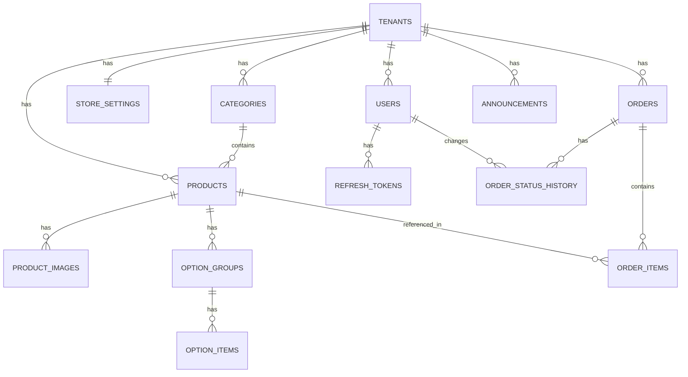

# Base de Datos - PickyApp

## 1. Visión General
-   **Motor**: PostgreSQL 15+
-   **ORM**: TypeORM 0.3+
-   **Patrón**: Multi-tenant con row-level isolation (tenant_id)
-   **Convenciones**:
    -   Tablas: `snake_case` plural (ej. `products`, `order_items`)
    -   Columnas: `snake_case` (ej. `tenant_id`, `created_at`)
    -   PKs: UUID v4 generado automáticamente
    -   FKs: `{tabla_singular}_id` (ej. `category_id`, `product_id`)

## 2. Esquema de Entidades

### Tenants (Comercios)
| Columna | Tipo | Descripción |
| :--- | :--- | :--- |
| `id` | UUID | PK |
| `slug` | VARCHAR(50) | URL única del comercio (ej. "mi-pizzeria") |
| `name` | VARCHAR(100) | Nombre del comercio |
| `email` | VARCHAR(255) | Email de contacto |
| `phone` | VARCHAR(20) | Teléfono principal |
| `whatsapp_number` | VARCHAR(20) | Número para pedidos |
| `logo_url` | TEXT | URL del logo |
| `is_active` | BOOLEAN | Estado del comercio |
| `created_at` | TIMESTAMP | Fecha de creación |
| `updated_at` | TIMESTAMP | Última actualización |

**Índices**:
- UNIQUE: `slug`
- INDEX: `is_active`

### Users (Administradores)
| Columna | Tipo | Descripción |
| :--- | :--- | :--- |
| `id` | UUID | PK |
| `tenant_id` | UUID | FK a tenants |
| `email` | VARCHAR(255) | Email único |
| `password_hash` | VARCHAR(255) | Bcrypt hash |
| `name` | VARCHAR(100) | Nombre del usuario |
| `is_active` | BOOLEAN | Estado de la cuenta |
| `created_at` | TIMESTAMP | Fecha de creación |
| `updated_at` | TIMESTAMP | Última actualización |

**Índices**:
- UNIQUE: `email`
- INDEX: `tenant_id`

### Refresh Tokens
| Columna | Tipo | Descripción |
| :--- | :--- | :--- |
| `id` | UUID | PK |
| `user_id` | UUID | FK a users |
| `token_hash` | VARCHAR(255) | Hash del token |
| `expires_at` | TIMESTAMP | Fecha de expiración |
| `created_at` | TIMESTAMP | Fecha de creación |

**Índices**:
- INDEX: `user_id`
- INDEX: `token_hash`
- INDEX: `expires_at`

### Store Settings
| Columna | Tipo | Descripción |
| :--- | :--- | :--- |
| `id` | UUID | PK |
| `tenant_id` | UUID | FK a tenants (UNIQUE) |
| `description` | TEXT | Descripción del negocio |
| `address` | TEXT | Dirección física |
| `primary_color` | VARCHAR(7) | Color primario (hex) |
| `accent_color` | VARCHAR(7) | Color de acento (hex) |
| `minimum_order` | DECIMAL(10,2) | Monto mínimo de pedido |
| `delivery_cost` | DECIMAL(10,2) | Costo de envío |
| `delivery_enabled` | BOOLEAN | Delivery habilitado |
| `takeaway_enabled` | BOOLEAN | Take away habilitado |
| `in_store_enabled` | BOOLEAN | Consumo en local habilitado |
| `payment_methods` | JSONB | Métodos de pago configurados |
| `business_hours` | JSONB | Horarios por día de semana |
| `social_links` | JSONB | Links a redes sociales |
| `created_at` | TIMESTAMP | Fecha de creación |
| `updated_at` | TIMESTAMP | Última actualización |

**Índices**:
- UNIQUE: `tenant_id`

### Categories
| Columna | Tipo | Descripción |
| :--- | :--- | :--- |
| `id` | UUID | PK |
| `tenant_id` | UUID | FK a tenants |
| `name` | VARCHAR(100) | Nombre de la categoría |
| `image_url` | TEXT | URL de la imagen |
| `order` | INTEGER | Orden de visualización |
| `is_active` | BOOLEAN | Estado activo/inactivo |
| `created_at` | TIMESTAMP | Fecha de creación |
| `updated_at` | TIMESTAMP | Última actualización |

**Índices**:
- INDEX: `tenant_id, is_active`
- INDEX: `tenant_id, order`

### Products
| Columna | Tipo | Descripción |
| :--- | :--- | :--- |
| `id` | UUID | PK |
| `tenant_id` | UUID | FK a tenants |
| `category_id` | UUID | FK a categories |
| `name` | VARCHAR(100) | Nombre del producto |
| `description` | TEXT | Descripción detallada |
| `price` | DECIMAL(10,2) | Precio base |
| `order` | INTEGER | Orden de visualización |
| `is_active` | BOOLEAN | Estado activo/inactivo |
| `is_featured` | BOOLEAN | Producto destacado |
| `created_at` | TIMESTAMP | Fecha de creación |
| `updated_at` | TIMESTAMP | Última actualización |

**Índices**:
- INDEX: `tenant_id, is_active`
- INDEX: `tenant_id, category_id`
- INDEX: `tenant_id, is_featured`
- INDEX: `name` (para búsqueda)

### Product Images
| Columna | Tipo | Descripción |
| :--- | :--- | :--- |
| `id` | UUID | PK |
| `product_id` | UUID | FK a products |
| `url` | TEXT | URL de la imagen |
| `order` | INTEGER | Orden de visualización |
| `is_main` | BOOLEAN | Imagen principal |
| `created_at` | TIMESTAMP | Fecha de creación |

**Índices**:
- INDEX: `product_id, order`

### Option Groups
| Columna | Tipo | Descripción |
| :--- | :--- | :--- |
| `id` | UUID | PK |
| `product_id` | UUID | FK a products |
| `name` | VARCHAR(100) | Nombre del grupo (ej. "Tamaño") |
| `type` | VARCHAR(20) | 'radio' o 'checkbox' |
| `is_required` | BOOLEAN | Grupo obligatorio |
| `min_selections` | INTEGER | Mínimo a seleccionar (checkbox) |
| `max_selections` | INTEGER | Máximo a seleccionar (checkbox) |
| `order` | INTEGER | Orden de visualización |
| `created_at` | TIMESTAMP | Fecha de creación |

**Índices**:
- INDEX: `product_id, order`

### Option Items
| Columna | Tipo | Descripción |
| :--- | :--- | :--- |
| `id` | UUID | PK |
| `option_group_id` | UUID | FK a option_groups |
| `name` | VARCHAR(100) | Nombre de la opción |
| `price_modifier` | DECIMAL(10,2) | Precio adicional (puede ser 0) |
| `is_default` | BOOLEAN | Opción por defecto |
| `order` | INTEGER | Orden de visualización |
| `created_at` | TIMESTAMP | Fecha de creación |

**Índices**:
- INDEX: `option_group_id, order`

### Orders
| Columna | Tipo | Descripción |
| :--- | :--- | :--- |
| `id` | UUID | PK |
| `tenant_id` | UUID | FK a tenants |
| `order_number` | VARCHAR(50) | Número legible (ORD-YYYYMMDD-XXX) |
| `status` | VARCHAR(20) | new, confirmed, preparing, on_way, delivered, cancelled |
| `customer_name` | VARCHAR(100) | Nombre del cliente |
| `customer_phone` | VARCHAR(20) | Teléfono del cliente |
| `customer_email` | VARCHAR(255) | Email del cliente (opcional) |
| `delivery_method` | VARCHAR(20) | delivery, takeaway, in_store |
| `delivery_address` | JSONB | Dirección completa (si delivery) |
| `payment_method` | VARCHAR(20) | cash, transfer, card, other |
| `subtotal` | DECIMAL(10,2) | Subtotal de items |
| `delivery_cost` | DECIMAL(10,2) | Costo de envío |
| `total` | DECIMAL(10,2) | Total del pedido |
| `notes` | TEXT | Notas del cliente |
| `internal_notes` | TEXT | Notas internas del admin |
| `created_at` | TIMESTAMP | Fecha de creación |
| `updated_at` | TIMESTAMP | Última actualización |

**Índices**:
- UNIQUE: `tenant_id, order_number`
- INDEX: `tenant_id, status`
- INDEX: `tenant_id, created_at`
- INDEX: `customer_phone` (para búsqueda)

### Order Items
| Columna | Tipo | Descripción |
| :--- | :--- | :--- |
| `id` | UUID | PK |
| `order_id` | UUID | FK a orders |
| `product_id` | UUID | FK a products (puede ser NULL si producto eliminado) |
| `product_name` | VARCHAR(100) | Nombre del producto (snapshot) |
| `unit_price` | DECIMAL(10,2) | Precio unitario base |
| `quantity` | INTEGER | Cantidad |
| `selected_options` | JSONB | Opciones seleccionadas con precios |
| `item_note` | TEXT | Nota específica del item |
| `subtotal` | DECIMAL(10,2) | Subtotal del item |
| `created_at` | TIMESTAMP | Fecha de creación |

**Índices**:
- INDEX: `order_id`

### Order Status History
| Columna | Tipo | Descripción |
| :--- | :--- | :--- |
| `id` | UUID | PK |
| `order_id` | UUID | FK a orders |
| `status` | VARCHAR(20) | Estado al que cambió |
| `changed_by` | UUID | FK a users (NULL si automático) |
| `created_at` | TIMESTAMP | Fecha del cambio |

**Índices**:
- INDEX: `order_id, created_at`

### Announcements
| Columna | Tipo | Descripción |
| :--- | :--- | :--- |
| `id` | UUID | PK |
| `tenant_id` | UUID | FK a tenants |
| `text` | VARCHAR(255) | Texto del anuncio |
| `background_color` | VARCHAR(7) | Color de fondo (hex) |
| `is_active` | BOOLEAN | Estado activo/inactivo |
| `order` | INTEGER | Orden de visualización |
| `created_at` | TIMESTAMP | Fecha de creación |
| `updated_at` | TIMESTAMP | Última actualización |

**Índices**:
- INDEX: `tenant_id, is_active, order`

## 3. Relaciones



## 4. Índices Clave para Performance

### Índices Compuestos Críticos
```sql
-- Búsqueda de productos activos por tenant
CREATE INDEX idx_products_tenant_active ON products(tenant_id, is_active);

-- Productos de una categoría
CREATE INDEX idx_products_tenant_category ON products(tenant_id, category_id);

-- Pedidos por estado y fecha
CREATE INDEX idx_orders_tenant_status_date ON orders(tenant_id, status, created_at DESC);

-- Búsqueda de productos por nombre
CREATE INDEX idx_products_name_trgm ON products USING gin(name gin_trgm_ops);
```

### Índices para Búsqueda Full-Text
```sql
-- Extensión para búsqueda de texto
CREATE EXTENSION IF NOT EXISTS pg_trgm;

-- Índice para búsqueda de productos
CREATE INDEX idx_products_search ON products USING gin(
  to_tsvector('spanish', name || ' ' || COALESCE(description, ''))
);
```

## 5. Constraints y Validaciones

### Check Constraints
```sql
ALTER TABLE products 
  ADD CONSTRAINT chk_price_positive CHECK (price >= 0);

ALTER TABLE orders 
  ADD CONSTRAINT chk_total_positive CHECK (total >= 0);

ALTER TABLE option_items 
  ADD CONSTRAINT chk_price_modifier_valid CHECK (price_modifier >= -price);
```

### Foreign Keys con Cascade
```sql
-- Eliminar producto elimina sus imágenes y opciones
ALTER TABLE product_images 
  ADD CONSTRAINT fk_product 
  FOREIGN KEY (product_id) REFERENCES products(id) 
  ON DELETE CASCADE;

-- Eliminar pedido elimina sus items
ALTER TABLE order_items 
  ADD CONSTRAINT fk_order 
  FOREIGN KEY (order_id) REFERENCES orders(id) 
  ON DELETE CASCADE;
```

## 6. Datos de Ejemplo (Seeds)

### Tenant Demo
```sql
INSERT INTO tenants (id, slug, name, email, phone, whatsapp_number, is_active)
VALUES (
  'demo-tenant-uuid',
  'demo-pizzeria',
  'Demo Pizzería',
  'demo@pickyapp.com',
  '+54 9 11 1234-5678',
  '+5491112345678',
  true
);
```

### Categorías Demo
```sql
INSERT INTO categories (tenant_id, name, image_url, "order", is_active)
VALUES 
  ('demo-tenant-uuid', 'Pizzas', 'https://example.com/pizzas.jpg', 1, true),
  ('demo-tenant-uuid', 'Empanadas', 'https://example.com/empanadas.jpg', 2, true),
  ('demo-tenant-uuid', 'Bebidas', 'https://example.com/bebidas.jpg', 3, true);
```

## 7. Mantenimiento

### Vacuum y Analyze
```sql
-- Ejecutar semanalmente
VACUUM ANALYZE products;
VACUUM ANALYZE orders;
VACUUM ANALYZE order_items;
```

### Limpieza de Tokens Expirados
```sql
-- Ejecutar diariamente
DELETE FROM refresh_tokens WHERE expires_at < NOW();
```

### Estadísticas de Uso
```sql
-- Tamaño de tablas
SELECT 
  schemaname,
  tablename,
  pg_size_pretty(pg_total_relation_size(schemaname||'.'||tablename)) AS size
FROM pg_tables
WHERE schemaname = 'public'
ORDER BY pg_total_relation_size(schemaname||'.'||tablename) DESC;
```
