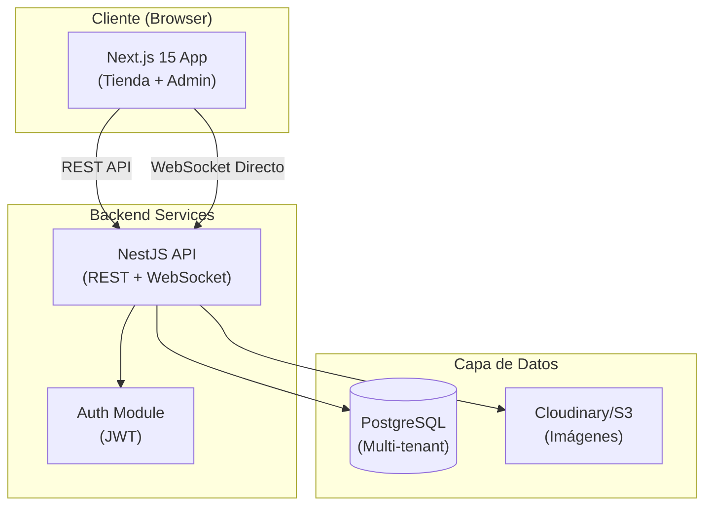
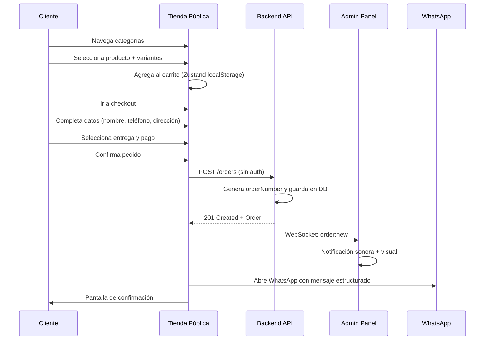
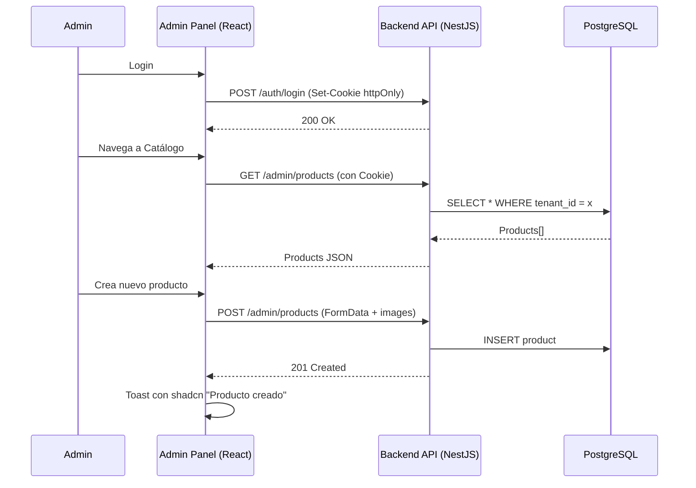
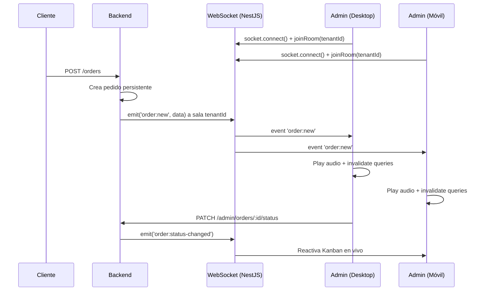

# PickyApp - Plataforma E-Commerce de Proximidad (MVP)

Este documento sirve como **punto de entrada principal** para toda la documentación técnica del proyecto PickyApp. Aquí encontrarás el índice completo de especificaciones, estándares y guías de arquitectura.

## 📚 Índice de Documentación

### 🏗️ Arquitectura y Estándares
Documentos base que definen cómo se construye el software.
- [**Arquitectura del Sistema**](architecture.md): Visión general, capas, módulos y patrones clave.
- [**Estándares de Código**](coding-standards.md): Guías de estilo, convenciones de nombres y buenas prácticas.
- [**Estándares UX/UI**](ui-ux-standards.md): Sistema de diseño, tokens, paleta de colores y patrones de interacción.
- [**Estándares de Testing**](testing-standards.md): Estrategias de prueba para Backend y Frontend.
- [**Orquestación de Agentes**](../../AGENTS.md): Roles, responsabilidades y mapa de la capa de IA.
- [**Plan de Implementación**](implementation-plan.md): Roadmap de desarrollo por fases.

### 🔌 API REST y Backend
Especificaciones para el desarrollo e integración de la API.
- [**Convenciones de API**](api/conventions.md): URLs, métodos HTTP y códigos de estado.
- [**Autenticación**](api/authentication.md): Flujos de Login, Registro y gestión de tokens.
- [**Autorización**](api/authorization.md): Multi-tenancy y control de acceso.
- [**Formato de Respuesta (Envelope)**](api/envelope.md): Estructura estándar de respuesta JSON.
- [**Manejo de Errores**](api/error-handling.md): Códigos de error y payloads estándar.
- [**Paginación**](api/pagination.md): Estrategia de paginación y metadatos.
- [**Filtrado y Ordenamiento**](api/filtering-sorting.md): Query params estándar.
- [**Versionado**](api/versioning.md): Estrategia de versionado de API.

### 💾 Datos y Persistencia
Diseño del modelo de datos y gestión de cambios.
- [**Base de Datos**](data/database.md): Esquema de tablas, entidades y relaciones.
- [**Migraciones**](data/migrations.md): Flujo de trabajo para cambios de esquema.
- [**Transacciones**](data/transactions.md): Manejo de atomicidad en operaciones complejas.

### 🔒 Seguridad
Políticas y mecanismos de protección.
- [**Visión General de Seguridad**](security/security-overview.md): Principios y mitigaciones de riesgos comunes.
- [**JWT Claims**](security/jwt-claims.md): Estructura y contenido de los tokens de acceso.
- [**Rate Limiting**](security/rate-limiting.md): Protección contra abuso y DoS.

### ☁️ Infraestructura y DevOps
Despliegue, configuración y operación.
- [**Entornos**](infrastructure/environments.md): Configuración para Dev, Staging y Prod.
- [**Docker y Contenedores**](infrastructure/docker.md): Estrategia de contenedores.
- [**Configuración**](infrastructure/configuration.md): Variables de entorno y validación.
- [**CI/CD**](infrastructure/ci-cd.md): Pipelines de integración y despliegue.
- [**Logging**](infrastructure/logging.md): Estrategia de observabilidad.
- [**Monitoreo y Métricas**](infrastructure/monitoring.md): Health checks y KPIs.

---

## 1. Descripción del Sistema

PickyApp es una plataforma de e-commerce de proximidad diseñada para comercios locales (restaurantes, tiendas, negocios de barrio) que permite gestionar catálogo, recibir pedidos y operar sin necesidad de conocimientos técnicos.

**Objetivos Principales del MVP:**
- Construir una plataforma funcional que permita demostración completa del ciclo de vida
- Superar la experiencia de usuario de Pedix en los módulos incluidos
- Arquitectura escalable preparada para crecimiento futuro
- Mobile-first completo: toda vista perfectamente usable en móvil 360px
- Panel administrador operativo sin asistencia técnica

**Stakeholders:**
- **Comerciante (Admin)**: Dueño del negocio que gestiona catálogo, pedidos y configuración
- **Cliente Final (Público)**: Usuario que navega la tienda y realiza pedidos sin registro
- **Desarrolladores**: Equipo técnico que implementa y mantiene la plataforma

## 2. Visión General de Arquitectura

### Stack Tecnológico

| Capa | Tecnología | Versión | Justificación |
| :--- | :--- | :--- | :--- |
| **Frontend** | Next.js (App Router) | 15.x | SSR nativo, RSC, optimización de imágenes, file-system routing |
| **Estado Global** | Zustand | ^5 | Liviano, sin boilerplate, altamente compatible con Server Components |
| **Cache de Servidor** | TanStack Query | ^5 | Cacheo inteligente de estado del servidor, optimistic updates |
| **Estilos** | Tailwind CSS v4 | ^4 | Utility-first, mobile-first por defecto, purge automático ultrarrápido |
| **UI Components** | shadcn/ui + Vaul | latest | Componentes accesibles (Radix), Vaul para drag gestures nativos en móviles |
| **Backend** | NestJS | ^10 | REST API modular, TypeScript, robusto y tipado |
| **Base de Datos** | PostgreSQL + TypeORM | PG 16 | Multi-tenant por tenant_id, robustez relacional |
| **Storage** | Cloudinary / S3 | — | Imágenes con transformación y optimización on-the-fly |
| **Auth** | JWT + Refresh Tokens | — | Access 15min, refresh 7d, httpOnly cookie vía BFF |
| **WebSocket** | Socket.io | ^4 | Pedidos en tiempo real. Cliente conecta directo al servidor NestJS |
| **Contenedores** | Docker + docker-compose | — | Dev y producción unificados mediante Dockerfiles |

### Diagrama de Alto Nivel

## 3. Módulos Funcionales del MVP

### MOD-01: Gestión del Catálogo
CRUD completo de categorías y productos con variantes. Back-office del administrador.
- Categorías con imágenes y orden manual
- Productos con múltiples imágenes, precio, variantes (opciones)
- Grupos de opciones: radio (única) o checkbox (múltiple)
- Activar/desactivar productos
- Productos destacados

### MOD-02: Tienda Pública
Front-end del cliente final. Zero login. Responsive, animada.
- Home con categorías y productos destacados
- Indicador abierto/cerrado basado en horarios
- Detalle de producto con selector de variantes (usando Vaul Bottom Sheet en móvil)
- Carrito persistente (localStorage vía Zustand)
- Checkout en 2 pasos
- Dispatch por WhatsApp

### MOD-03: Gestión de Pedidos
Centro de pedidos en tiempo real del administrador. WebSocket para actualizaciones instantáneas.
- Vista Kanban por estados
- Notificaciones sonoras y visuales
- Detalle completo de pedidos
- Cambio de estado manual
- Imprimir pedidos

### MOD-04: Configuración de la Tienda
Toda la personalización del comercio.
- Información básica y redes sociales
- Horarios de atención por día
- Formas de entrega (delivery, take away, presencial)
- Métodos de pago
- Tema visual dinámico (colores primario y acento desde SSR anti-FOUC)
- Anuncios en tienda

### MOD-05: Panel Administrador
Layout, navegación, dashboard y UX del back-office.
- Dashboard con métricas del día
- Navegación responsiva (bottom nav móvil, sidebar desktop)
- Estadísticas básicas
- Onboarding wizard para nuevos comercios

### MOD-06: Autenticación y Seguridad
Login, registro, protección de rutas.
- Registro de comerciante
- Login con JWT vía HttpOnly cookies
- Middleware de autenticación para rutas `/admin`
- Refresh token automático
- Recuperar contraseña

## 4. Flujos de Negocio Clave

### 4.1. Flujo de Pedido (Cliente Final)

### 4.2. Flujo de Gestión de Catálogo (Admin)

### 4.3. Flujo de Pedido en Tiempo Real (Admin)

## 5. Plan de Implementación (Resumen)

### Fase 0: Setup y Fundamentos (Semana 1)
- Configuración del monorepo con scopes `api` y `app`
- Setup de Next.js 15 (App Router, Tailwind CSS v4, shadcn/ui)
- Setup de NestJS modular (Base de datos PostgreSQL, TypeORM)
- Docker compose local unificado
- Estrategia SSR anti-FOUC para inyección de temas del tenant

### Fase 1: Autenticación y Base (Semana 1-2)
- MOD-06: Registro, login, HttpOnly cookies, interceptors
- Layout responsivo del panel admin (Sidebar/BottomNav)
- Componentes compartidos base

### Fase 2: Catálogo (Semana 2-3)
- MOD-01: CRUD de categorías y ordenamiento
- MOD-01: CRUD de productos y gestor de variantes
- Subida de imágenes con Cloudinary

### Fase 3: Tienda Pública (Semana 3-4)
- MOD-02: Home y listado optimizado por categorías
- MOD-02: Ficha de producto (Bottom Sheet Vaul en móviles)
- MOD-02: Carrito reactivo con Zustand

### Fase 4: Checkout y Pedidos (Semana 4-5)
- MOD-02: Checkout en dos pasos e integración con WhatsApp
- MOD-03: Centro de monitoreo Kanban de pedidos
- MOD-03: Conexión directa WebSocket Socket.io para actualizaciones en tiempo real

### Fase 5: Configuración y Dashboard (Semana 5-6)
- MOD-04: Personalización completa del comercio (Horarios, Temas, Anuncios)
- MOD-05: Dashboard de analíticas diarias
- MOD-05: Wizard de onboarding guiado

### Fase 6: Pulido y Testing (Semana 6)
- Micro-animaciones y gestos optimizados
- Tests unitarios y de integración críticos
- Optimización de carga inicial (LCP, CLS)
- Entrega de documentación técnica final

## 6. Criterios de Éxito del MVP

| Criterio | Métrica | Objetivo |
| :--- | :--- | :--- |
| **Demo funcional** | Flujo completo sin errores | Zero errores bloqueantes en demo de 20 min |
| **Mobile-first** | Usabilidad en 360px | Sin scroll horizontal, gestos drag Vaul nativos |
| **Performance** | Carga inicial en 4G | LCP < 2.5 segundos |
| **UX superior** | Feedback vs Pedix | Interfaz animada, transiciones premium, fluidez nativa |
| **Autonomía admin** | Setup autónomo | El comerciante puede autogestionar el 100% del MVP |

## 7. Exclusiones del MVP

Los siguientes módulos NO están incluidos en el MVP:
- ❌ Pagos online y pasarelas
- ❌ Facturación electrónica
- ❌ Integraciones logísticas externas
- ❌ CRM avanzado y fidelización
- ❌ Módulo de marketing / Meta Ads
- ❌ Multi-sucursal
- ❌ Analytics avanzado

